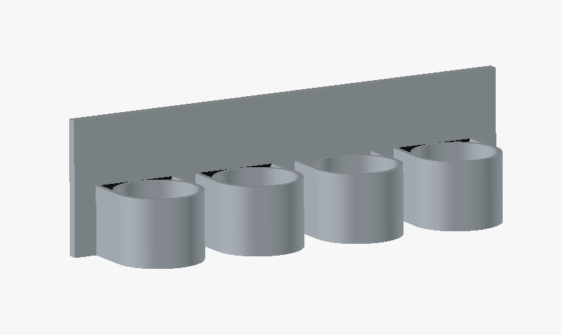

# Wall Mount Flashlight Holder

This folder contains a Python script that generates a 4-slot flashlight holder 3D model that can be 3D printed. The model can be mounted on the wall with command strips.

## Rendering

## Files

- generate_flashlight_mount.py: Model generator script.
- flashlight_wall_mount.3mf: Last generated output mesh.
- flashlight_wall_mount_render.png: Preview rendering used in this README.

## What It Generates

- A 4-slot wall mount plate.
- Cups oriented parallel to the wall.
- No screw holes.
- Side support ribs where cups meet the plate.
- Default cup inner diameter of 47.0 mm.

## Requirements

- Python 3
- One of these export backends:
- FreeCAD CLI (freecadcmd), preferred
- OpenSCAD CLI (openscad), fallback

If neither backend is available, mesh export will fail.

## Quick Start

From the repository root:

python3 wall_mount_flashlight_holder/generate_flashlight_mount.py

This writes:

- wall_mount_flashlight_holder/flashlight_wall_mount.3mf

## Common Commands

Generate default 3MF:

python3 wall_mount_flashlight_holder/generate_flashlight_mount.py --output-mesh wall_mount_flashlight_holder/flashlight_wall_mount.3mf --mesh-format 3mf

Generate STL instead:

python3 wall_mount_flashlight_holder/generate_flashlight_mount.py --output-mesh wall_mount_flashlight_holder/flashlight_wall_mount.stl --mesh-format stl

Increase cup diameter to 47.5 mm:

python3 wall_mount_flashlight_holder/generate_flashlight_mount.py --slot-diameter 47.5 --output-mesh wall_mount_flashlight_holder/flashlight_wall_mount.3mf

Skip mesh export (geometry build only):

python3 wall_mount_flashlight_holder/generate_flashlight_mount.py --no-mesh

## Main Options

- --output-mesh: Output mesh path. Default is flashlight_wall_mount.3mf.
- --mesh-format: 3mf or stl. Default is 3mf.
- --slot-diameter: Cup inner diameter in mm. Default is 47.0.
- --slot-depth: Cup depth in mm. Default is 38.0.
- --slot-wall-thickness: Cup wall thickness in mm. Default is 3.0.
- --slot-bottom-thickness: Cup closed-end thickness in mm. Default is 3.0.
- --horizontal-gap: Gap between cups across X in mm. Default is 12.0.
- --vertical-gap: Gap between rows in mm. Default is 12.0.
- --margin: Plate margin around layout in mm. Default is 14.0.
- --plate-thickness: Back plate thickness in mm. Default is 6.0.
- --columns and --rows: Must multiply to 4.

## Notes

- The script is configured for exactly 4 total slots.
- Output suffix is normalized to match --mesh-format.
- If FreeCAD is installed, it is used first for mesh export.
